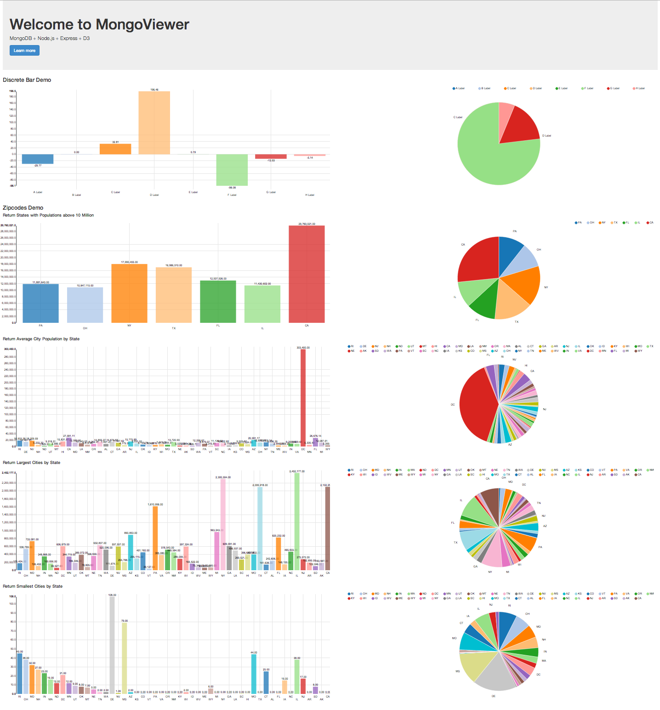

MongoViewer
===========

> MongoDB + Node.js + Express + D3



## Installation

```bash
npm install
bower install
```

## API

### Version 1

```
/api/v1/
```

#### `Find`

See [db.collection.find](http://mongodb.github.io/node-mongodb-native/api-generated/collection.html#find).

```
/api/v1/:collection/find
```

##### Query Parameters:
- query
- options

### `FindOne`

See [db.collection.findOne](http://mongodb.github.io/node-mongodb-native/api-generated/collection.html#findone).

```
/api/v1/:collection/findOne
```

##### Query Parameters:
- query
- options

### `Aggregate`

See [db.collection.aggregate](http://mongodb.github.io/node-mongodb-native/api-generated/collection.html#aggregate).

```
/api/v1/:collection/aggregate
```

##### Query Parameters:
- pipeline
- options

## Example API Usage

### Load the example dataset, `discreteData`

```
node load.js
```

### Start the Server

```bash
node index.js
```

This will start the server. Now you can view at [http://localhost:8080/](http://localhost:8080/).

### Example `find` API Query

Request: [http://localhost:8080/api/v1/discreteBar/find?query={"label":"A Label"}](http://localhost:8080/api/v1/discreteBar/find?query={%22label%22:%22A%20Label%22})

Response:

```json
[
  {
    "label": "A Label",
    "value": -29.765957771107,
    "_id": "532e5294c1f6d3f17df677ba"
  }
]
```


### Example `findOne` API Query

Request: [http://localhost:8080/api/v1/discreteBar/findOne?query={"label":"A Label"}](http://localhost:8080/api/v1/discreteBar/findOne?query={%22label%22:%22A%20Label%22})

Response:

```json
{
  "label": "A Label",
  "value": -29.765957771107,
  "_id": "532e5294c1f6d3f17df677ba"
}
```


### Example `aggretate` API Query

Request: [http://localhost:8080/api/v1/discreteBar/aggregate?pipeline=[{"$match":{"label":"A Label"}}]](http://localhost:8080/api/v1/discreteBar/aggregate?pipeline=[{%22$match%22:{%22label%22:%22A%20Label%22}}])

Response:

```json
[
  {
    "label": "A Label",
    "value": -29.765957771107,
    "_id": "532e5294c1f6d3f17df677ba"
  }
]
```

